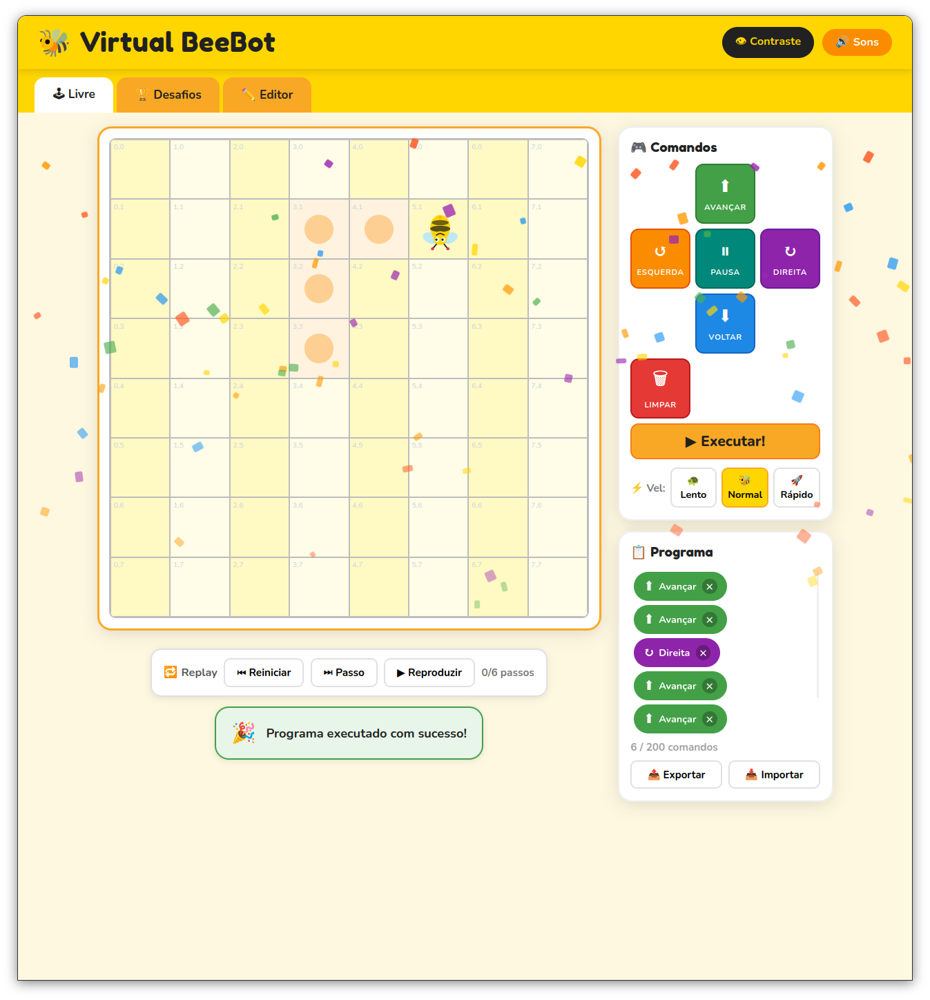

# Virtual BeeBot 🐝



Virtual BeeBot é um jogo educativo para o navegador que ensina lógica de programação básica para crianças. Monte uma sequência de comandos e guie a abelha robô pelo tabuleiro 8×8 — sem precisar instalar nada.

Inspirado nas aulas da Mind Maker da minha filha Lucia, no Colégio Santa Catarina.

## Recursos

- **Livre** — Explore o tabuleiro livremente, com marcadores e controles de replay
- **Desafios** — Complete fases com flores, obstáculos e objetivos
- **Editor** — Crie e salve níveis personalizados no navegador
- **Fila de comandos** — Avançar, Esquerda, Direita, Voltar e Pausa
- **Exportar / importar** — Compartilhe programas em arquivo
- **Acessibilidade** — Modo alto contraste e sons opcionais
- **Atalhos de teclado** — W/A/S/D, Espaço, Enter e Escape

## Como rodar

Abra o arquivo `index.html` em um navegador moderno ou suba um servidor local:

```bash
python3 -m http.server 8000
```

Depois, acesse [http://localhost:8000](http://localhost:8000).

## Tecnologias

HTML, CSS e JavaScript puros — sem compilação e sem dependências.
